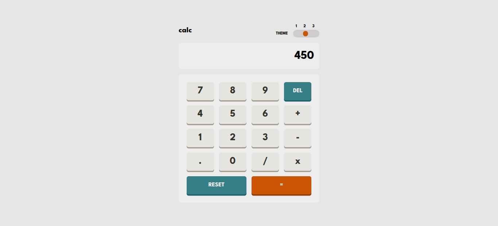

# Frontend Mentor - Calculator app solution

This is a solution to the [Calculator app challenge on Frontend Mentor](https://www.frontendmentor.io/challenges/calculator-app-9lteq5N29).

## Table of contents

- [Overview](#overview)
  - [The challenge](#the-challenge)
  - [Links](#links)
  - [Screenshot](#screenshot)
- [My process](#my-process)
  - [Built with](#built-with)
- [Author](#author)

## Overview
### The challenge
Users should be able to:

- See the size of the elements adjust based on their device's screen size
- Perform mathmatical operations like addition, subtraction, multiplication, and division
- Adjust the color theme based on their preference
- **Bonus**: Have their initial theme preference checked using `prefers-color-scheme` and have any       additional changes saved in the browser

### Links

- Solution URL: [solution](https://github.com/Medido1/Calculator-app)
- Live Site URL: [live site](https://frontendcalculatorap.netlify.app/)

### Screenshot
  ## Theme1
  
  ## Theme2
  
  ## Theme3
  
  
## My process

### Built with

- React
- Tailwindcss
- Flexbox
- Grid
- Mobile-first workflow
- Vanilla css

## Author

- Frontend Mentor - [@Medido1](https://www.frontendmentor.io/profile/Medido1)
- GitHub - [@Medido1](https://github.com/Medido1)